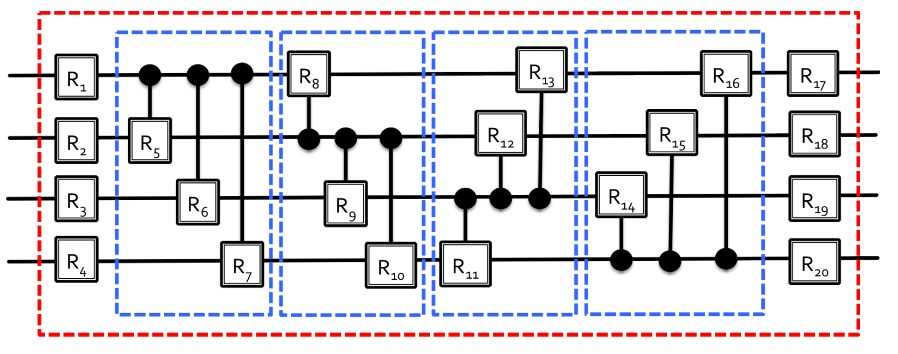

# Quantum Autoencoder for Quantum Data Compression 

## Introduction
 Quantum computing have been showing its tremendous advantages in many tasks, where it is slow or even impossible for classical algorithms to be employed, ranging from cryptography to quantum simulation. For example, once we have sufficiently powerful quantum computers, Shor's algorithm will factorize large numbers in minutes. Quantum simulators for chemistry have also been shown to be capable of efficiently calculating molecular energies for small system. In our NISQ area, however, the limited amount of quantum computing resources may prevent us from achieving desired results. Therefore, it is essential to find methods to compress quantum data, saving up resources needed. Our Quantum Autoencoder (QAE) project is based on the model proposed by Romero et al. [[1]](https://iopscience.iop.org/article/10.1088/2058-9565/aa8072/meta). We implement a quantum-classical hybrid procedure to perform training QAE, then we demonstrate its performance on MNIST handwritten digits database.
 
## Model  
  </img>
  
  *Picture adapted from original paper.  is an (n+k) input. The top k (3 in this picture) qubits are discarded after encoding, then a 'fresh' k-qubit reference state is added.*
  
  In classical AE, we apply the encoder, a deep NN, to compress an (n + k) bits into an n bits. The NN weights are then trained on training set so as to minmize the loss, which is usually defined by the Euclidean distance between the input vector and the output reconstructed vector. On the other hand, operations in the quantum world are reversible, so the encoder gives us (n + k) qubits, which means k qubits are “trash state”. Then, to reconstruct the original state, we discard this trash state and add in “fresh” k qubits as fixed “reference state”. The cost function is defined by averaged fidelity between "trash state" and "reference state". We measure this quantity by performing the swap test. 
  Schematic circuit:
  
  </img> 
  
  Encoder circuit proposed by [[1]], where the rotation parameters will be learned
  
  </img> 
  
  Our circuit with 4-qubit input.  
  
  </img> 

## Training: Hybrid quantum-classical procedure
  As in many state-of-the-art quantum algorithms, we implement a hybrid procedure. 
  The steps in a single iterations are:
   1. Prepare the input state  and the reference state (we choose to use )
   2. Apply the encoder .
   3. Measure the cost function, which is the fidelity between the trash state and the reference state via a Swap test.
  On classical computer, perform minimization of loss function over parameters  until convergence. As suggested by the authors of [[1]], we use Basin- Hopping algorithms with L-BFGS-B optimizer, provided by python library Scipy.
  
## Results
  We train the model on two datasets: Hydrogen molecule orbitals and MNIST handwritten digits.
 
  Results:
  
  \\add figures.
  
  Due to limitations of time and resources, we was not able to......
## Discussion
  Compression rate not impressive.
  Encoder circuit not universal.
  Try higher dimensional data in the future.
  
## References
  [1] J. Romero, J. P. Olson, and A. Aspuru-Guzik, “Quantumautoencoders for efficient compression of quantum data,” Quantum Science and Technology, vol. 2, p. 045001, Aug2017.

